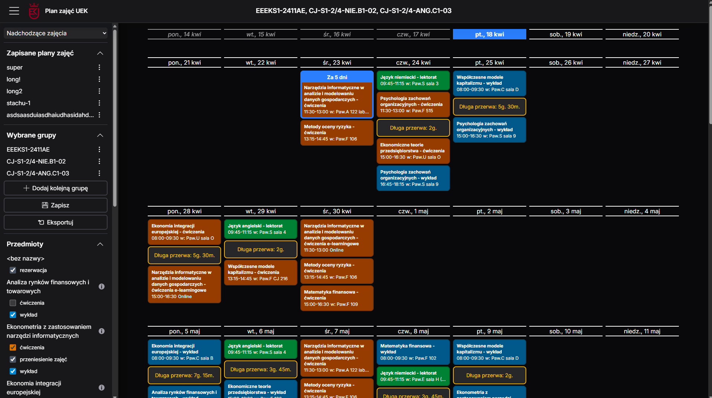
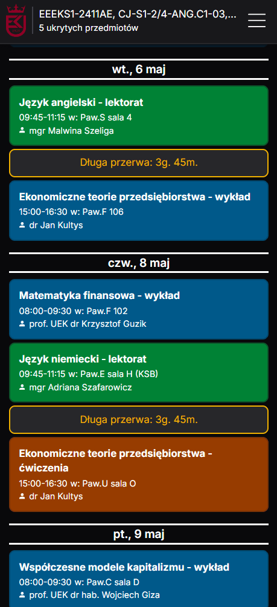

# [UEK - plan zajęć](https://uek-planzajec-v3.fly.dev/)

**Wrapper around official [UEK Plan Zajęć](https://planzajec.uek.krakow.pl) with nice new features**

| Desktop                                           | Mobile                                          |
| ------------------------------------------------- | ----------------------------------------------- |
|  |  |

✅ View multiple schedules at once (e.g. main group + language groups)  
✅ Save schedules to come back to them quickly  
✅ Hide subjects from schedules (useful if there is are classes in the schedule that you don't attend)  
✅ Connect the schedule to Google Calendar via ical  
✅ Highlight long breaks between classes and days with online-only classes  
✅ Easy to share - most of page state is kept in the URL  
✅ Full mobile support - in browser and with a PWA  
✅ Client-side and server-side caching  
✅ Dynamic time period selection (upcoming/current year instead of UEK-provided time periods)

[V1](https://github.com/szczursonn/uek-planzajec) with NextJS Page Router  
[V2](https://github.com/szczursonn/uek-planzajec-v2) with SvelteKit
