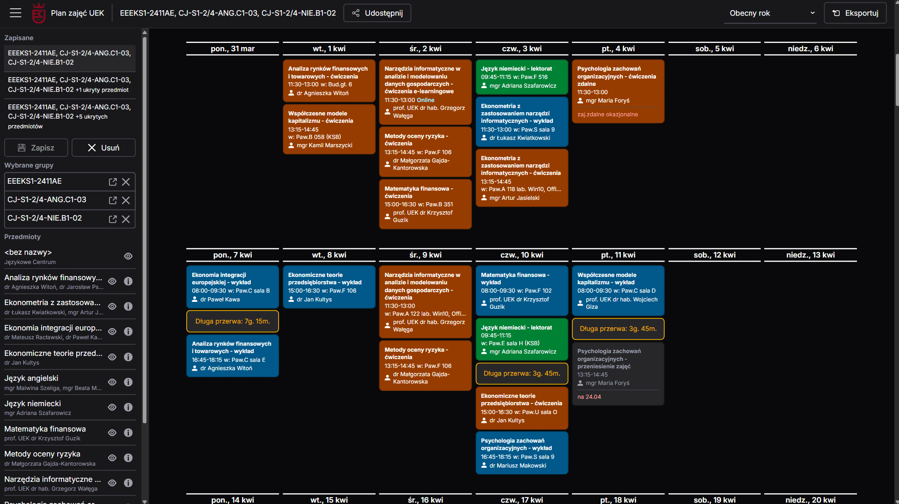

# [UEK - plan zajęć](https://uek-planzajec-v3.fly.dev/)

**Wrapper around official [UEK Plan Zajęć](https://planzajec.uek.krakow.pl) with nice new features**

| Desktop                                           | Mobile                                          |
| ------------------------------------------------- | ----------------------------------------------- |
|  |  |

✅ View multiple schedules at once (e.g. main group + language groups)  
✅ Save schedules to come back to them quickly  
✅ Hide subjects from schedules (useful if there is a class in the schedule you don't attend)  
✅ Connect the schedule to Google Calendar via ical  
✅ Highlight long breaks between classes  
✅ Most of page state is kept in the URL - easy to share  
✅ Full mobile support with a PWA

[V1](https://github.com/szczursonn/uek-planzajec) with NextJS Page Router  
[V2](https://github.com/szczursonn/uek-planzajec-v2) with SvelteKit
